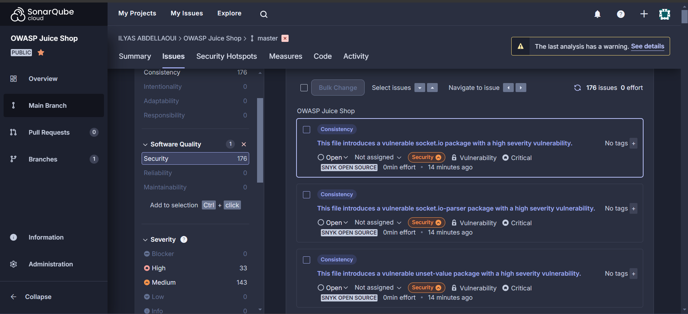
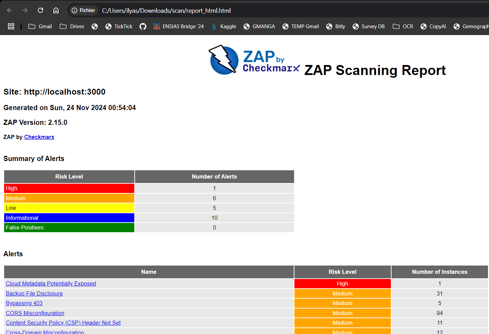

# DevSecOps CI/CD Pipeline for OWASP Juice Shop

This fork demonstrates a **DevSecOps CI/CD pipeline** for the [OWASP Juice Shop](https://github.com/juice-shop/juice-shop), a vulnerable web application ideal for security training. The pipeline is implemented using GitHub Actions and integrates **security testing**, **vulnerability management**, and **automated redeployment**.

## Features & Pipeline Overview
1. **Continuous Integration/Deployment (CI/CD):**
   - Automates the deployment of the Juice Shop Docker image.
   - Verifies the health and accessibility of the deployed application.

2. **Integrated Security Testing:**
   - **SAST**: Uses [CodeQL](https://github.com/github/codeql) for static code analysis.
   - **SCA**: Uses [Snyk](https://snyk.io/) to scan for vulnerabilities in dependencies.
   - **DAST**: Employs [OWASP ZAP](https://www.zaproxy.org/) to perform runtime security tests.
   - Uploads security results as artifacts.

3. **Vulnerability Management:**
   - Combines and processes results into SARIF & XML reports.
   - Integrates with [SonarCloud](https://sonarcloud.io/).

4. **Automated Redeployment:**
   - Redeploys Juice Shop after codebase changes or vulnerability fixes.

---

## Screenshots
- **SonarCloud Analysis**: [SonardCloud Dashboard](https://sonarcloud.io/summary/new_code?id=ilyasabdellaoui_owasp-juice-shop)
  

- **OWASP ZAP Report**:  
  

---

## Getting Started
### Prerequisites
- Docker installed locally.
- Secrets configured in GitHub Actions:
  - `SNYK_TOKEN`
  - `SONAR_TOKEN`
  - `SONAR_ORGANIZATION`
  - `SONAR_PROJECT_KEY`

### Running the Pipeline
1. Push code changes to the `master` branch.
2. Monitor GitHub Actions for pipeline execution.
3. Review artifacts and vulnerability findings.

### Redeployment
- Triggered automatically on successful vulnerability management or source code updates.

---

## Licensing

This program is free software: you can redistribute it and/or modify it under the terms of the [MIT license](LICENSE).
OWASP Juice Shop and any contributions are Copyright © by Bjoern Kimminich & the OWASP Juice Shop contributors
2014-2024.

